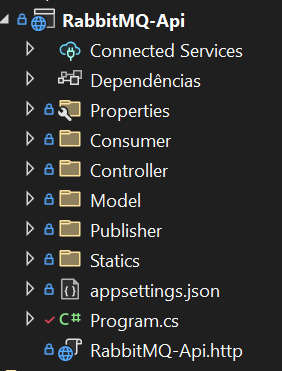
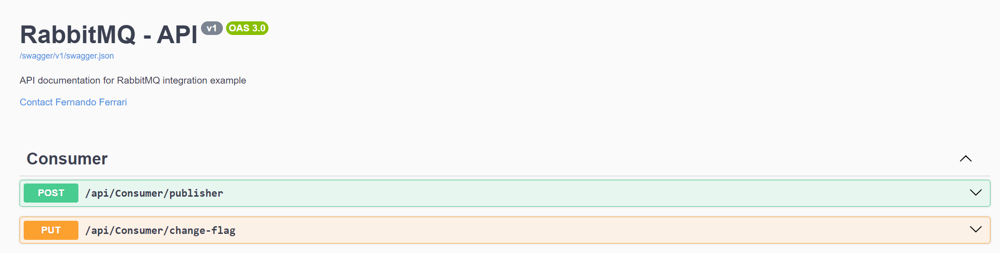

RabbitMQ-Sdk
===

## Contéudo do Projeto
- Sdk:  `RabbitMq`
- Testes Unitários: `RabbitMqTests`
- Api com Integração:  `RabbitMQ-Api`
- Extra: `Dockerfile`


<br>

## Instalação e Dependência do Projeto
- RabbitMQ.Client
- Polly
- Newtonsoft.Json

<br>

### Instalação do RabbitMQ
- <a id="dockerfile"></a>**Docker** - Siga as instruções específicas para criar e configurar o RabbitMQ com Docker.
  - Crie um volume para persistência de dados:
    ```bash
    docker volume create rabbitmq_data
    ```
  - Construa a imagem Docker usando o `Dockerfile` localizado na soluction do projeto:

    ```bash
    docker build -t my-rabbitmq .
    ```
  - Inicie o contêiner RabbitMQ, montando o volume para persistência de dados:

    ```bash
    docker run -d --name rabbitmq-server -p 5672:5672 -p 15672:15672 -v rabbitmq_data:/var/lib/rabbitmq my-rabbitmq
    ```
  - **Sugestão** - [Docker Desktop ](https://www.docker.com/products/docker-desktop/)
<br>
- **Windows**
  - Consulte a [documentação oficial](https://www.rabbitmq.com/docs/install-windows) para orientações detalhadas sobre a instalação do RabbitMQ no Windows.
  - A documentação fornece informações sobre requisitos de sistema, opções de configuração e passos de instalação.

<br>

### Implementação do Sdk
<a id="implementacao"></a>
- Instalação das Dependências necessárias.
  ```bash
    dotnet add package RabbitMQ.Client
    dotnet add package Polly
    dotnet add package Newtonsoft.Json
    ```
- Referência do sdk no projeto.
  - Se você estiver usando o Visual Studio, siga estes passos:
    ```
      1 -> Clique com o botão direito no nome do projeto no Solution Explorer.
      2 -> Selecione Add > Reference.
      3 -> Na janela de referência que aparecer, clique em Browse e navegue até a pasta onde está localizada a DLL que você deseja referenciar.
      4 -> Selecione a DLL e clique em OK.
    ```  
  - Se você está utilizando a linha de comando com o .NET CLI, pode usar o seguinte comando para adicionar uma referência
    ```
    dotnet add reference <caminho_da_dll>
    ```
- Injeção de Dependência e HostedServices.
  - Serviço:
    ```
    builder.Services.AddRabbitMq("localhost", "/", 5672, "guest", "guest", false);
    ```
  - Consumer:
    ```
    builder.Services.AddHostedService<MyModel>();
    ``` 
  - Publisher
    ```
    builder.Services.AddSingleton<MyModelPublisher>();
    ``` 
- Classe / Model
  - Consumer:
    ```
     public class MyModelConsumer : GenericSubscriber<MyModel>
     {
          public MyModelConsumer(IServiceProvider serviceProvider) : base(serviceProvider)
          {
          }

          protected override string Queue => "my-consumer";
          protected override string DeadQueue => "my-consumer-exception";
          protected override string DelayedQueue => "my-consumer-retry";
          protected override int RetryDelay => 5;
          protected override int RetryAttempts => 3;

          protected override void ExceptionExecute(IServiceProvider provider, Exception exception, Context<MyModel> context, int attempt, CancellationToken ctx)
          {
          }

          protected override async Task ProcessMessage(IServiceProvider serviceProvider, Context<MyModel> context, CancellationToken stoppingToken)
          {
              await Task.CompletedTask;
          }
    }
    ```
  - Publisher:
    ```
    public class MyModelPublisher : QueuePublisher<MyModel>
    {
      public MyModelPublisher(IServiceProvider services) : base(services)
      {
      }

      protected override string QueueName => "my-consumer";
    }
    ```
<br>

### Api com RabbitMq Integrado

- **Soluction**

  - Definição
    - Consumer ( Classe de Subscriber do RabbitMQ )
    - Controller ( Controladora )
    - Model ( Modelo utilizado no Consumer/Publisher )
    - Static ( Configuração estatica - flag )
- **Swagger**

  - Definição
    - Post ( Responsável por publicar na queue do RabbitMQ o Model com Id random e o Nome atribuido no body da requisição )
    - Pust ( Responsável por alterar uma flag static existente no projeto com intuito de executar uma exception no consumer do RabbitMq enviando o payload para retry e exception queue )
