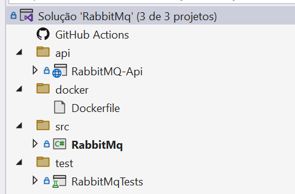

RabbitMQ-Sdk
===

## Contéudo do Projeto
- Sdk:  `RabbitMq`
- Testes Unitários: `RabbitMqTests`
- Api com Integração:  `RabbitMQ-Api`
- Extra: `Dockerfile`




## Instalação e Dependência
- RabbitMQ.Client
- Polly
- Newtonsoft.Json

### Sugestão de Instalação do RabbitMq
- **Docker**
  - Siga as instruções específicas para criar e configurar o RabbitMQ com Docker.
  - Utilize volumes para persistência de dados.
  - **Criar e iniciar o volume**
  - Crie um volume para persistência de dados:

    ```bash
    docker volume create rabbitmq_data
    ```

- **Construir a imagem Docker**
  - Construa a imagem Docker usando o `Dockerfile`:

    ```bash
    docker build -t my-rabbitmq .
    ```

- **Executar o contêiner com o volume**
  - Inicie o contêiner RabbitMQ, montando o volume para persistência de dados:

    ```bash
    docker run -d --name rabbitmq-server -p 5672:5672 -p 15672:15672 -v rabbitmq_data:/var/lib/rabbitmq my-rabbitmq
    ```

- **Windows**
  - Consulte a [documentação oficial](https://www.rabbitmq.com/docs/install-windows) para orientações detalhadas sobre a instalação do RabbitMQ no Windows.
  - A documentação fornece informações sobre requisitos de sistema, opções de configuração e passos de instalação.